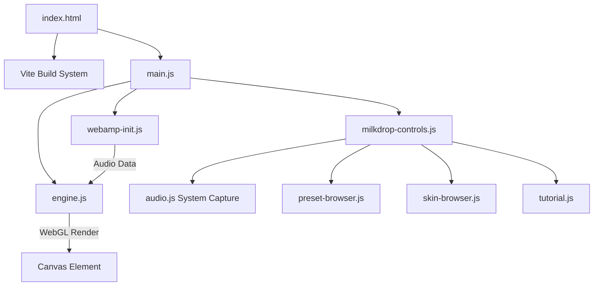

# Architecture Map
*Freshness: 2026-05-01*

## High-Level Overview
BrainBlur is a fully client-side, web-native application that brings the classic MilkDrop 2 visualizer and Winamp player to modern browsers.

## Core Systems
1.  **Player Engine**: Powered by Webamp, managing skins, audio playback (MP3 drop), and providing the audio analyzer node.
2.  **Visualizer Engine**: Powered by Butterchurn, taking the audio node and rendering WebGL graphics to a full-screen canvas.
3.  **UI Controls**: A custom, modern HTML/CSS overlay built with vanilla JavaScript, providing global controls (Zen mode, Favorites, Scaling) and modular dialogs for navigating thousands of assets.
4.  **Audio Pipeline**: Dual-source audio intake capable of reading either the Webamp track or hooking directly into system audio via `getDisplayMedia`.
